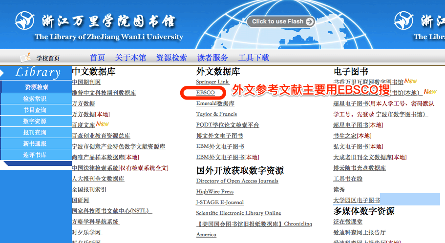

```{r setup, include=FALSE}
knitr::opts_chunk$set(echo = TRUE)
```

这里是2014级论文写作的讨论贴，关于论文框架、资料查找、时间进度等相关安排，我都会记在这里，方便大家查阅。

# 论文框架

## 中小机构对服务中小客户更有优势吗？以银行业为例 

2014010309 陆怡婷

传统的观点认为中小金融机构比大型机构机构在服务中小客户上更有优势。

以上观点成立的一个前提条件是，大型机构在资金来源成本上低成本的优势不能抵消其在机构运营上高成本的劣势。但是如果在一种经济环境中，机构的运营模式是趋同的，都是一种粗放低成本的方式，那么小型机构在运营上的低成本优势就不会那么明显，于是大型机构在资金成本上的优势在竞争中就显得更加凸出。

中国的金融机构一直有粗放经营的传统，特别是银行，被批评只会收抵押放贷款。在这种业务经营模式比较简单的情况下，大机构可能业务向中小客户拓展，可能也增加不了多少运营费用。


### 验证的思路：

1. 比较大银行和小银行的中小客户业务条线的运营费用的差异。零售业务条线可以用来近似代替中小客户业务条线。（这个可以再讨论，在文献阅读中可以进一步补充。）

2. 比较大型银行和小型银行子在融资成本上的差异。比如存款利率，贴现利率等。

3. 比较以上两大差异，如果大银行在融资成本上的优势差异大于小银行在运用费用上的优势差异，我们就认为中小机构在服务中小客户上没有更多的优势。

## 关于并购绩效的评价方法 

<!-- 2014010593  方涛  -->

## 中美两国股市名义价格水平的对比研究 

2014011060  王锦浩


有研究表明美国自大萧条开始至今，物价上涨了10倍多，然而美国股票的名义平均价格一直保持在35美元上[@Weld2009]。

这是一个比较有趣的现象，对此，我们可以研究下中国自股市开始运行以来的股票平均价格是多少，看一下中国的股票平均价是否也是多年维持不变。

如果中国的股价平均数也是多年维持不变的话，比较下两国股票平均价格多年不变的原因。如果中国变的话，可以分析下为什么中国变，而美国不变。

选这个题目是因为今年行为经济学比较热门（今年的诺贝尔经济学奖就是颁发给行为经济学领域的学者的），美国的名义平均股价维持不变可能是一种习惯，美国人认为当一般股票的股价到70美元一股的时候，可能就显得太高了，于是就会分拆股票，于是股价维持在35美元附近。这种习惯就是一种心理因素，可以用行为经济学的东西来分析。


## 金融部门规模与经济增长质量关系研究 

2014011082 王雅迪


金融部门规模与经济增长质量之间的桥梁是金融部门的职能。

如果金融部门职能发挥得好，那么就会促进经济增长；如果金融部门只能发挥得不好，那么就会带来破坏经济增长。

金融部门的核心职能是动员资金、风险定价。也就是要平衡好资金动员过程过程中的风险控制问题。

我们以浙江省为例子，来分析经济转型过程中，浙江的金融规模膨胀和金融风险控制的经验，来说明规模与质量之间的关系。


### 先期目标：

1. 目前有一种趋向，认为金融业的增加值占GDP的比重越高，那么当地经济发展水平越高。可以找一下有关这方面的论述，到时可作为文章的导语部分。

2. 网民“江南愤青”有一系列名为“浙江经济怎么了”的帖子，生动的分析了浙江经济发展中金融领域的乱象，可以找来看看。

3. 十九大报告提高的金融为实体服务，以及人民银行周小川行长的文章《[守住不发生系统性金融风险的底线](http://www.pbc.gov.cn/goutongjiaoliu/113456/113469/3410388/index.html)》


## 央行资产负债表规模与企业融资成本关系研究 

2014011103 郑雯


央行操作的目标是通过央行的风险承担，来弥补市场过度避险导致的金融市场的萎缩。

央行的资产负债表扩张只是一个中间目标，最终目标实现金融机构信贷活动的参与，和企业融资成本的稳定。这里的关键是金融机构要有稳定和安全的预期。


因此，对企业融资成本的分析，就变为对金融机构预期行为的分析。预期存在与经营环境当中，那么我们就需要分析当下的经营环境是如何限制企业的选择，从而决定了在央行扩展资产负债表的情况下，他们对未来未来经济的预期。

### 一个简单的博弈论模型

央行和金融机构双方博弈，如果央行和金融机构同时行动，那么央行和金融机构都获得较低收益；如果央行和企业都不行动，那么双方都遭受损失。如果一方行动而另一方不行动，那么不行动的那一方获较大收益和行动的那一方受较大损。

博弈的结果是双方都不行动。

|      |        |          央行          |
|------|--------|-----------|------------|
|      |        | 行动      | 不行动     |
| 机构 | 行动   | （1，1）  | （-2，2）  |
|      | 不行动 | （2，-2） | （-1，-1） |


## 从资金流量表看中国金融系统结构的变化 

2014011454  涂铭杭


这是一个探索性分析的问题，可能没有预先设定的目标，目前想到的可行的思路

1. 综述一下目前资金流量表分析方法的进展，这个可以看看国民经济核算的教材，以及人大贝多广教授的两篇文章。

罗煜, 贝多广. 资金流量分析方法的最新进展[J]. 经济学动态, 2015(2):87-97.

贝多广, 骆峰. 资金流量分析方法的发展和应用[J]. 经济研究, 2006(2):92-103.

2. 参照这篇[从资金流量表看美国金融结构的变化](http://www.cf40.org.cn/plus/view.php?aid=1738)分析下中国的情况。


## 金融部门竞争与社会福利关系研究 

2014012935 陈翔宇


金融部门的核心问题是要解决信息不对称，如果竞争导致的是信息的透明化，那么社会福利将会得到改善。

因此，这个问题可以变为，在何种情况下，竞争会导致信息的扩散？

中国目前的金融业格局，是否符合竞争带来扩散的条件？

为此促进信息扩散，我么应该怎么做？

## 商业银行信用卡风险管理研究 

2014014171  包从赶


# 资料搜集

## 中文

### 百度学术--开题分析

http://xueshu.baidu.com/u/biye

这个是免费的，不需要账号密码


在上面输入关键词后，就能找到跟你论文有关的经典文章。

找出来的问章可能不能下载全文，这是你就可以用下面这个学校购买的数据库——中国知网——来下载全文。

### 中国知网

这个是收费的，要在校园网访问才能用

http://www.cnki.net

## 英文


必应学术，https://www.bing.com/academic

百度学术,http://xueshu.baidu.com

都能搜到大量免费的论文

学校图书馆也购买了一些收费的外文文献库，首推ebsco





其次是Taylor & Francis和 Springer Link 两个数据库。

## 资料求助

有些论文，可能网上找不到，学校文献库里也没有买，这时候可以到论坛上发帖求助，让别人帮你找。

人大经济论坛就专门有一个让人发帖求助文献的板块（🙏）。你们可以自己注册个账号发帖，也可以借用我的账号发帖。。

论坛网址：http://bbs.pinggu.org

发帖求助板块的网址：http://bbs.pinggu.org/forum-86-1.html

求助的时候一定按照论坛规定的格式发帖。

# 时间进度

2017.11.21日上午10点，来62-511办公室讨论论文思路。


---
参考文献：

